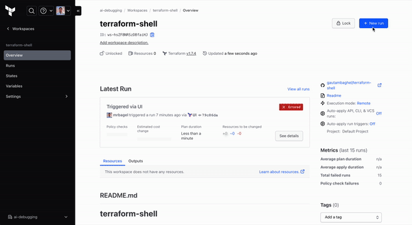
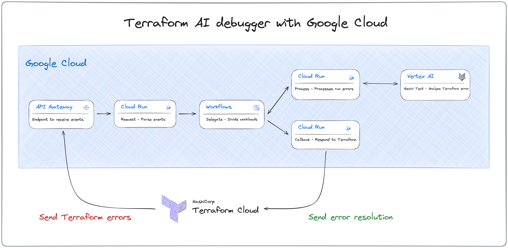

# terraform-google-ai-debugger

## Overview

The AI debugger for Terraform is a tool designed to address runtime issues, enhancing the identification and resolution of challenges in deploying developer infrastructure. It leverages Google Cloud services and Terraform Cloud to optimize the remediation process.



## Architecture

The diagram below shows the Terraform AI debugger components leveraging low cost serverless Google Cloud resources.



Resources created in Google Cloud are:
- API Gateway
- Cloud Functions - callback, process, request
- Cloud Storage Bucket
- Service Accounts
- Secrets Manager
- Workflow
- Vertex AI - Gemini Pro Text

## Pre-requisites

Pre-requisites for the AI debugger deployment only:
- Google Cloud SDK
- Google Cloud project with owner permissions
- Google Cloud credentials setup
  - gcloud auth application-default login
  - gcloud auth login
- Makefile
- Terraform v1.4+
- Terraform Cloud account and workspace created
- Terraform sample deployment to connect to the above workspace

Additional pre-requisites for cloud function development:
- Python 3.10+
- Python IDE, e.g. PyCharm

## Deploy

### Google Cloud
Create a file in the terraform folder named terraform.tfvars.
```hcl
project_id = "__GOOGLE_PROJECT__"
tfc_api_key = "__TERRAFORM_CLOUD_API_KEY__"
terraform_org_name = "__TERRAFORM_CLOUD_ORG_NAME__"
terraform_workspace_names = ["__TF_WS_1_NAME__", "__TF_WS_2_NAME__"]
```

- `project_id` - Google project id for deploying services
- `tfc_api_key` - The Terraform Cloud API key, this could be the team (recommended) or user token
- `terraform_org_name` - The Terraform Cloud organization name
- `terraform_workspace_names` - The list of Terraform Cloud workspace names to attach debugger

To format the Terraform config files use

```bash
terraform -chdir=terraform fmt
```

Execute the commands below to deploy the Google Cloud resources

```bash
terraform -chdir=terraform init
terraform -chdir=terraform plan
terraform -chdir=terraform apply
```

## Destroy

A secrets manager secret is not destroyed by Terraform so delete it manually

```bash
gcloud secrets delete terraform-cloud-api-key-{random_str_here}
```

All the resources deployed to the Google Cloud project can be destroyed with the single command below

```bash
terraform -chdir=terraform destroy
```

## Cloud Function Development

The cloud functions for the AI debugger are in the folders below:
- [callback](cloud_functions/callback)
- [process](cloud_functions/process)
- [request](cloud_functions/request)

Cloud Function pytests have been created in the folder [cloud_functions/tests](cloud_functions/tests) to aid local development and unit testing.

Terraform pytests have been created in the folder [tests](tests) to deploy, test and destroy resources, run them as follows:

```bash
cd tests/
pipenv run test_default
```
