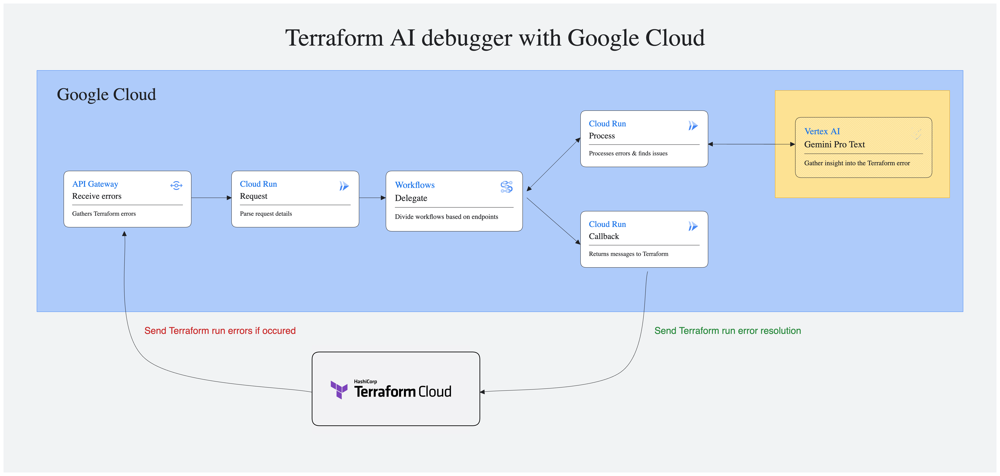

# terraform-google-ai-debugger

## Overview

```hcl
provider google {
  project = "__GOOGLE_PROJECT_ID__"
}
```
```hcl
provider google {
  project = var.project
}
```

## Architecture

The diagram below shows the Terraform AI debugger components leveraging low cost serverless Google Cloud resources.



Resources created in Google Cloud are:
- API Gateway
- Cloud Functions - callback, process, request
- Cloud Storage Bucket
- Service Accounts
- Workflow
- Vertex AI - Gemini Pro Text

## Pre-requisites

Pre-requisites for the AI debugger deployment only:
- Google Cloud SDK
- Google Cloud project with owner permissions
- Google Cloud credentials setup
  - gcloud auth application-default login
  - gcloud auth login
- Makefile
- Terraform v1.4+
- Terraform Cloud account and workspace created
- Terraform sample deployment to connect to the above workspace

Additional pre-requisites for cloud function development:
- Python 3.10+
- Python IDE, e.g. PyCharm

## Deploy

### Google Cloud
Create a file in the terraform folder named terraform.tfvars.
```hcl
project_id = "__GOOGLE_PROJECT__"
```

- `project_id` - Google project id for deploying services

Execute the commands below to deploy the Google Cloud resources

```bash
terraform -chdir=terraform init
terraform -chdir=terraform plan
terraform -chdir=terraform apply
```

To format the Terraform config files use

```bash
terraform -chdir=terraform fmt
```

### Terraform Cloud

[Terraform Cloud](https://app.terraform.io) Notification set up is required next. Under the Terraform Cloud workspace go to `settings\notifications` add with the following settings:
- Endpoint URL - Terraform output variable `api_gateway_endpoint_uri`
- HMAC key - Should match the terraform input variable `hmac_key`
- Notification even - select error

## Destroy

All the resources deployed to the Google Cloud project can be destroyed with the single command below

```bash
terraform -chdir=terraform destroy
```

## Cloud Function Development

The cloud functions for the AI debugger are in the folders below:
- [callback](cloud_functions/callback)
- [process](cloud_functions/process)
- [request](cloud_functions/request)

Cloud Function pytests have been created in the folder [cloud_functions/tests](cloud_functions/tests) to aid local development and unit testing.

Terraform pytests have been created in the folder [tests](tests) to deploy, test and destroy resources.
